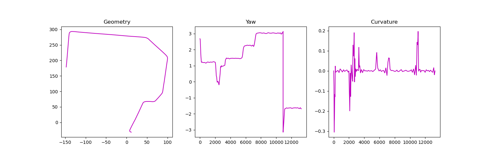

# SciPyCubicSpline

[](https://lgtm.com/projects/g/winstxnhdw/SciPyCubicSpline/alerts/)
[](https://lgtm.com/projects/g/winstxnhdw/SciPyCubicSpline/context:python)

SciPyCubicSpline is a simple lightweight wrapper for SciPy's [CubicSpline](https://docs.scipy.org/doc/scipy/reference/generated/scipy.interpolate.CubicSpline.html). This wrapper simplifies the interpolation of coarse path data and allows the user to solely compute the profile of the path, such as path curvature and yaw. For large paths, it can be up to 300x faster than Atsushi Sakai's [PyCubicSpline](https://github.com/AtsushiSakai/pycubicspline). Look at the [notebook](tests/test.ipynb) for more information and examples.

<div align="center">
    
</div>

#### generate_cubic_spline

```yaml
:param x:               (ArrayLike) x-coordinate of the coarse path [m]
:param y:               (ArrayLike) y-coordinate of the coarse path [m]
:param ds:              (float) desired linear displacement between each point, defaults to 0.05 [m]
:param bc_type:         (string) type of bounding condition, defaults to 'natural'

:return x:              (ndarray) x-coordinate of the cubic spline path [m]
:return y:              (ndarray) y-coordinate of the cubic spline path [m]
:return yaw:            (ndarray) discrete yaw of the cubic spline path [rad]
:return curvature:      (ndarray) discrete curvature of the cubic spline path [1/m]
```

#### generate_cubic_path

```yaml
:param x:               (ArrayLike) x-coordinate of the coarse path [m]
:param y:               (ArrayLike) y-coordinate of the coarse path [m]
:param ds:              (float) desired linear displacement between each point, defaults to 0.05 [m]
:param bc_type:         (string) type of bounding condition, defaults to 'natural'

:return x:              (ndarray) x-coordinate of the cubic spline path [m]
:return y:              (ndarray) y-coordinate of the cubic spline path [m]
```

#### calculate_spline_yaw

```yaml
:param x:               (ArrayLike) x-coordinate of the coarse path [m]
:param y:               (ArrayLike) y-coordinate of the coarse path [m]
:param ds:              (float) desired linear displacement between each point, defaults to 0.05 [m]
:param bc_type:         (string) type of bounding condition, defaults to 'natural'

:return yaw:            (ndarray) discrete yaw of the cubic spline path [rad]
```

#### calculate_spline_curvature

```yaml
:param x:               (ArrayLike) x-coordinate of the coarse path [m]
:param y:               (ArrayLike) y-coordinate of the coarse path [m]
:param ds:              (float) desired linear displacement between each point, defaults to 0.05 [m]
:param bc_type:         (string) type of bounding condition, defaults to 'natural'

:return curvature:      (ndarray) discrete curvature of the cubic spline path [1/m]
```

## Installation

```bash
pip install numpy scipy
```

## Troubleshoot

The following error occurs if the input points contain one or more **consecutive duplicates** of a point.

```python
>>> generate_cubic_spline()
ValueError: 'x' must be strictly increasing sequence.
```

You may fix this by removing the offending duplicate from the input manually or with the following code.

```python
remove_duplicates = lambda x: [v for i, v in enumerate(x) if i == 0 or v != x[i - 1]]
x = remove_duplicates(x)
y = remove_duplicates(y)
```

## Example

```python
import pandas as pd
from cubic_spline_interpolator import generate_cubic_spline

dir_path = 'waypoints.csv'
df = pd.read_csv(dir_path)

x = df['x'].values
y = df['y'].values
ds = 0.1

px, py, pyaw, pk = generate_cubic_spline(x, y, ds)
```
